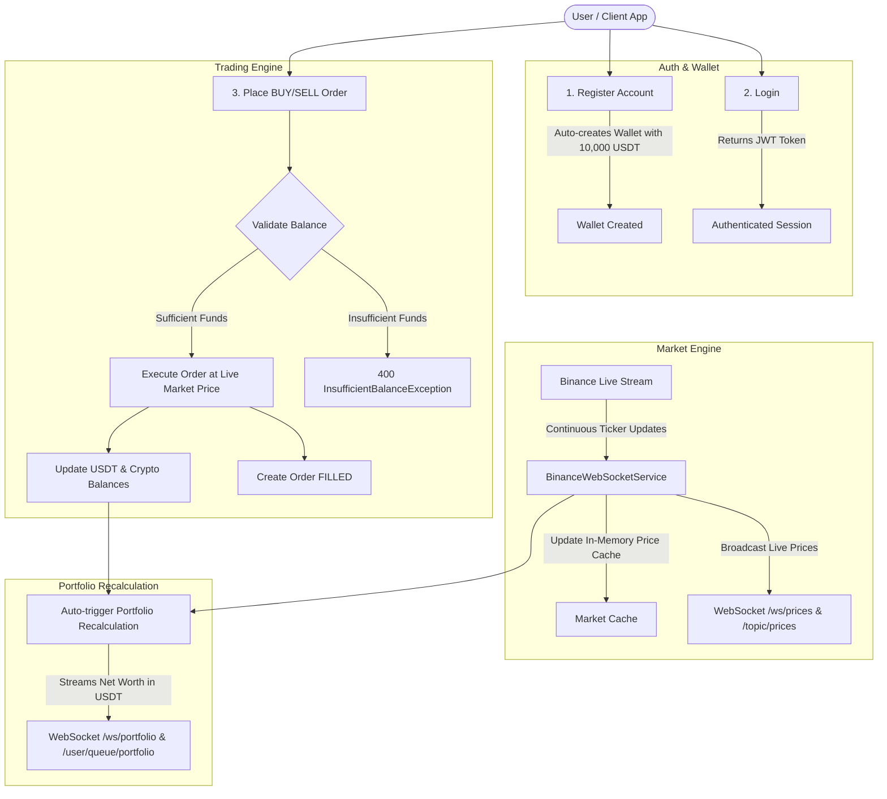
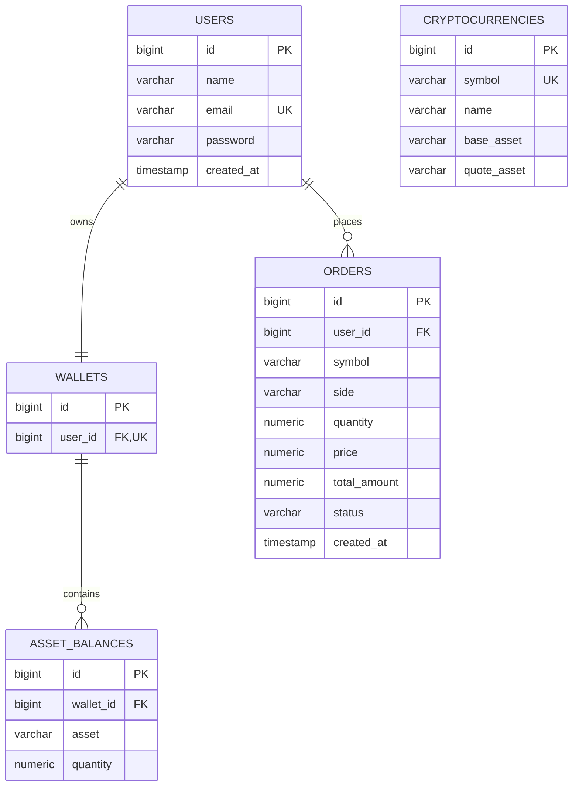

# 🚀 Let's Trade — Backend Documentation & API Reference

Welcome to the **Let's Trade** documentation. This document provides a complete guide to the architecture, workflow, REST API endpoints, real-time WebSocket streams, database models, and local setup for the cryptocurrency paper-trading platform.

---

## 📑 Table of Contents
1. [Overview & Tech Stack](#1-overview--tech-stack)
2. [End-to-End System Architecture & Flow](#2-end-to-end-system-architecture--flow)
3. [Authentication & Security](#3-authentication--security)
4. [Complete REST API Reference](#4-complete-rest-api-reference)
   - [Auth Endpoints](#auth-endpoints)
   - [User Endpoints](#user-endpoints)
   - [Cryptocurrency Endpoints](#cryptocurrency-endpoints)
   - [Market Data Endpoints](#market-data-endpoints)
   - [Wallet Endpoints](#wallet-endpoints)
   - [Order & Trading Endpoints](#order--trading-endpoints)
   - [Portfolio Endpoints](#portfolio-endpoints)
5. [Real-Time WebSockets Reference](#5-real-time-websockets-reference)
   - [Raw WebSocket Endpoints (Postman / Direct Client)](#raw-websocket-endpoints)
   - [STOMP Message Broker Topics (Web / Mobile Apps)](#stomp-message-broker-topics)
6. [Database Schema & Entities](#6-database-schema--entities)
7. [Error Handling & Standard Responses](#7-error-handling--standard-responses)
8. [Local Development & Testing](#8-local-development--testing)

---

## 1. Overview & Tech Stack

**Let's Trade** is a paper-trading cryptocurrency backend built for trading simulation without financial risk.

* **Language / Framework:** Java 17+, Spring Boot 4.x
* **Security:** Spring Security with stateless JWT (JSON Web Tokens) & BCrypt password hashing
* **Database & ORM:** PostgreSQL 17, Spring Data JPA, Hibernate
* **External Market Data:** Binance Public REST API & Binance Live WebSocket stream (`wss://stream.binance.com:9443/ws/!miniTicker@arr`)
* **Real-time WebSockets:** Spring WebSocket, STOMP message broker, and Raw TextWebSocket handlers
* **JSON Processing:** Jackson Databind

---

## 2. End-to-End System Architecture & Flow



### Core Workflow Steps:
1. **Registration & Auto-Wallet:** When a user creates an account, the backend registers the user and automatically creates their personal wallet initialized with **10,000 USDT** simulated paper funds (`0 BTC`, `0 ETH`).
2. **Login & JWT:** Users log in to receive a signed JWT token used for all private requests.
3. **Live Market Feed:** The backend connects to Binance's WebSocket stream. When a coin's price changes, it updates the local price cache and broadcasts the new price over WebSockets.
4. **Instant Order Execution:** When placing a BUY or SELL order:
   - The backend checks live prices and verifies sufficient balance.
   - It deducts the paid asset, credits the received asset, and marks the order as `FILLED`.
5. **Real-time Portfolio Valuation:** Whenever market prices move or an order is executed, the user's total net worth in USDT is dynamically recalculated and streamed live to their connected WebSocket session.

---

## 3. Authentication & Security

All protected endpoints require the HTTP Header:
```http
Authorization: Bearer <YOUR_JWT_TOKEN>
```

* **Public Endpoints (No Token Required):**
  - `POST /api/auth/**` (Register, Login)
  - `GET /api/cryptocurrencies/**` and `GET /api/cryptos/**`
  - `GET /api/market/**`
  - `GET /ws/**` (WebSocket handshake)
* **Protected Endpoints (Token Required):**
  - `/api/users/**`
  - `/api/wallet/**`
  - `/api/orders/**`
  - `/api/portfolio/**`

---

## 4. Complete REST API Reference

### Auth Endpoints

#### 1. Register Account
* **URL:** `POST /api/auth/register`
* **Access:** Public
* **Request Body:**
  ```json
  {
    "name": "Alex Trader",
    "email": "alex@example.com",
    "password": "Password123!"
  }
  ```
* **Response:** `201 Created`

#### 2. Login
* **URL:** `POST /api/auth/login`
* **Access:** Public
* **Request Body:**
  ```json
  {
    "email": "alex@example.com",
    "password": "Password123!"
  }
  ```
* **Response:** `200 OK`
  ```json
  {
    "token": "eyJhbGciOiJIUzI1NiIsInR5cCI6IkpXVCJ9..."
  }
  ```

---

### User Endpoints

#### 3. View Current User Profile
* **URL:** `GET /api/users/me`
* **Access:** Authenticated
* **Headers:** `Authorization: Bearer <TOKEN>`
* **Response:** `200 OK`
  ```json
  {
    "id": 1,
    "name": "Alex Trader",
    "email": "alex@example.com",
    "createdAt": "2026-09-24T21:30:00"
  }
  ```

---

### Cryptocurrency Endpoints

#### 4. List All Tradable Cryptocurrencies
* **URL:** `GET /api/cryptocurrencies` (or `GET /api/cryptos`)
* **Access:** Public
* **Response:** `200 OK`
  ```json
  [
    {
      "symbol": "BTCUSDT",
      "name": "Bitcoin",
      "baseAsset": "BTC",
      "quoteAsset": "USDT"
    },
    {
      "symbol": "ETHUSDT",
      "name": "Ethereum",
      "baseAsset": "ETH",
      "quoteAsset": "USDT"
    },
    {
      "symbol": "SOLUSDT",
      "name": "Solana",
      "baseAsset": "SOL",
      "quoteAsset": "USDT"
    }
  ]
  ```

#### 5. View Specific Crypto Details (with Price & 24h Change)
* **URL:** `GET /api/cryptocurrencies/{symbol}`
* **Example:** `GET /api/cryptocurrencies/BTCUSDT`
* **Access:** Public
* **Response:** `200 OK`
  ```json
  {
    "symbol": "BTCUSDT",
    "name": "Bitcoin",
    "baseAsset": "BTC",
    "quoteAsset": "USDT",
    "price": 95420.50,
    "priceChange24h": 2.35
  }
  ```

---

### Market Data Endpoints

#### 6. Get Current Market Price
* **URL:** `GET /api/market/{symbol}/price`
* **Example:** `GET /api/market/BTCUSDT/price`
* **Access:** Public
* **Response:** `200 OK`
  ```json
  {
    "symbol": "BTCUSDT",
    "price": 95420.50
  }
  ```

#### 7. Get 24h Market Statistics
* **URL:** `GET /api/market/{symbol}/stats`
* **Example:** `GET /api/market/BTCUSDT/stats`
* **Access:** Public
* **Response:** `200 OK`
  ```json
  {
    "symbol": "BTCUSDT",
    "price": 95420.50,
    "priceChangePercent": 2.35,
    "highPrice": 96800.00,
    "lowPrice": 93200.00,
    "volume": 14502.80
  }
  ```

---

### Wallet Endpoints

#### 8. View Wallet Balance
* **URL:** `GET /api/wallet`
* **Access:** Authenticated
* **Headers:** `Authorization: Bearer <TOKEN>`
* **Response:** `200 OK`
  ```json
  {
    "assets": [
      {
        "symbol": "USDT",
        "quantity": 10000.00
      },
      {
        "symbol": "BTC",
        "quantity": 0.00
      },
      {
        "symbol": "ETH",
        "quantity": 0.00
      }
    ]
  }
  ```

#### 9. Deposit Simulated Paper Money
* **URL:** `POST /api/wallet/deposit`
* **Access:** Authenticated
* **Headers:** `Authorization: Bearer <TOKEN>`
* **Request Body:**
  ```json
  {
    "asset": "USDT",
    "amount": 5000.00
  }
  ```
* **Response:** `200 OK` (returns updated balances)
  ```json
  {
    "assets": [
      {
        "symbol": "USDT",
        "quantity": 15000.00
      },
      {
        "symbol": "BTC",
        "quantity": 0.00
      }
    ]
  }
  ```

---

### Order & Trading Endpoints

#### 10. Place Buy or Sell Order (Market Execution)
* **URL:** `POST /api/orders`
* **Access:** Authenticated
* **Headers:** `Authorization: Bearer <TOKEN>`
* **Request Body (BUY Example):**
  ```json
  {
    "symbol": "BTCUSDT",
    "side": "BUY",
    "quantity": 0.01
  }
  ```
* **Request Body (SELL Example):**
  ```json
  {
    "symbol": "BTCUSDT",
    "side": "SELL",
    "quantity": 0.005
  }
  ```
* **Response:** `200 OK`
  ```json
  {
    "id": 1,
    "symbol": "BTCUSDT",
    "side": "BUY",
    "quantity": 0.01,
    "price": 95420.50,
    "totalAmount": 954.2050,
    "status": "FILLED",
    "createdAt": "2026-09-24T22:15:30"
  }
  ```

#### 11. View Order History
* **URL:** `GET /api/orders`
* **Access:** Authenticated
* **Headers:** `Authorization: Bearer <TOKEN>`
* **Response:** `200 OK`
  ```json
  [
    {
      "id": 1,
      "symbol": "BTCUSDT",
      "side": "BUY",
      "quantity": 0.01,
      "price": 95420.50,
      "totalAmount": 954.2050,
      "status": "FILLED",
      "createdAt": "2026-09-24T22:15:30"
    }
  ]
  ```

#### 12. View Specific Order Details
* **URL:** `GET /api/orders/{id}`
* **Example:** `GET /api/orders/1`
* **Access:** Authenticated
* **Headers:** `Authorization: Bearer <TOKEN>`
* **Response:** `200 OK`

---

### Portfolio Endpoints

#### 13. View Portfolio & Total Net Worth
* **URL:** `GET /api/portfolio`
* **Access:** Authenticated
* **Headers:** `Authorization: Bearer <TOKEN>`
* **Response:** `200 OK`
  ```json
  {
    "totalValueUsdt": 10000.00,
    "holdings": [
      {
        "asset": "USDT",
        "quantity": 9045.795,
        "priceUsdt": 1.0,
        "valueUsdt": 9045.80
      },
      {
        "asset": "BTC",
        "quantity": 0.01,
        "priceUsdt": 95420.50,
        "valueUsdt": 954.20
      }
    ]
  }
  ```

---

## 5. Real-Time WebSockets Reference

Let's Trade provides two types of WebSocket connections:
1. **Raw WebSocket Endpoints:** Ideal for Postman, mobile clients, and simple socket connections.
2. **STOMP Message Broker:** Ideal for web applications (React, Angular, Vue) using pub/sub topics and private user queues.

---

### Raw WebSocket Endpoints

#### A. Live Market Prices Stream
* **URL:** `ws://localhost:8080/ws/prices` (or `ws://localhost:8080/ws/raw`)
* **Behavior:** Automatically streams live price updates as soon as connected.
* **Message Payload:**
  ```json
  {
    "symbol": "BTCUSDT",
    "price": 95420.50
  }
  ```

#### B. Live Personal Portfolio & Holdings Stream
* **URL:** `ws://localhost:8080/ws/portfolio?token=<YOUR_JWT_TOKEN>`
* **Alternative:** Connect to `ws://localhost:8080/ws/portfolio` and send `{"token": "<YOUR_JWT_TOKEN>"}` as your first message.
* **Behavior:** 
  1. Immediately sends your current portfolio snapshot.
  2. Whenever prices change or a trade happens, it recalculates and pushes your new total net worth and asset values in real-time!
* **Message Payload:**
  ```json
  {
    "totalValueUsdt": 10004.21,
    "holdings": [
      {
        "asset": "USDT",
        "quantity": 9045.80,
        "priceUsdt": 1.0,
        "valueUsdt": 9045.80
      },
      {
        "asset": "BTC",
        "quantity": 0.01,
        "priceUsdt": 95421.00,
        "valueUsdt": 954.21
      }
    ]
  }
  ```

---

### STOMP Message Broker Topics

* **Handshake URL:** `ws://localhost:8080/ws/market` (SockJS: `http://localhost:8080/ws/market`)

#### Subscriptions:
| Topic / Queue | Description | Message Content |
| :--- | :--- | :--- |
| `/topic/prices` | All cryptocurrency price changes | `{"symbol":"BTCUSDT","price":95420.50}` |
| `/topic/market/{symbol}` | Specific pair price changes (e.g. `/topic/market/BTCUSDT`) | `{"symbol":"BTCUSDT","price":95420.50}` |
| `/user/queue/portfolio` | Private user portfolio stream (Authenticated via JWT in CONNECT header) | `{"totalValueUsdt": ..., "holdings": [...]}` |

#### JavaScript Client Example (STOMP):
```javascript
import SockJS from 'sockjs-client';
import { Stomp } from '@stomp/stompjs';

const socket = new SockJS('http://localhost:8080/ws/market');
const stompClient = Stomp.over(socket);

// Pass JWT token in connect header
stompClient.connect({
    'Authorization': 'Bearer ' + token
}, () => {
    // 1. Subscribe to all market prices
    stompClient.subscribe('/topic/prices', (msg) => {
        console.log('Price update:', JSON.parse(msg.body));
    });

    // 2. Subscribe to private user portfolio updates
    stompClient.subscribe('/user/queue/portfolio', (msg) => {
        console.log('My Updated Portfolio:', JSON.parse(msg.body));
    });
});
```

---

## 6. Database Schema & Entities



---

## 7. Error Handling & Standard Responses

All exceptions (validation errors, resource not found, insufficient balance) return standardized JSON:

### Example: Insufficient Balance (400 Bad Request)
```json
{
  "timestamp": "2026-09-24T22:15:30.123",
  "status": 400,
  "error": "Insufficient Balance",
  "message": "Insufficient USDT balance. Required: 95420.50, Available: 10000.00"
}
```

### Example: Resource Not Found (404 Not Found)
```json
{
  "timestamp": "2026-09-24T22:15:30.123",
  "status": 404,
  "error": "Not Found",
  "message": "Cryptocurrency not found with symbol: INVALIDCOIN"
}
```

---

## 8. Local Development & Testing

### 1. Start PostgreSQL (Docker)
```bash
docker compose up -d
```
*(Runs PostgreSQL 17 on port `5433` with database `trading`)*

### 2. Run the Application
```bash
./mvnw spring-boot:run
```
*(Runs on `http://localhost:8080`)*

### 3. Run Automated Tests
```bash
./mvnw test
```
All integration tests covering user registration, authentication, wallet operations, order execution, market feeds, and WebSockets will execute and validate the system.
